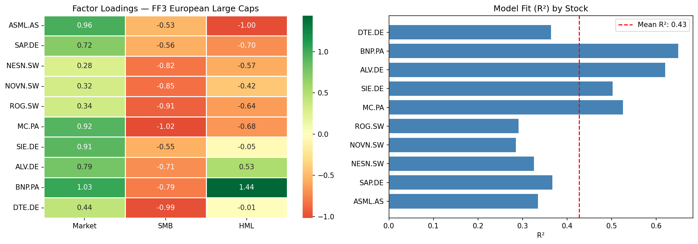
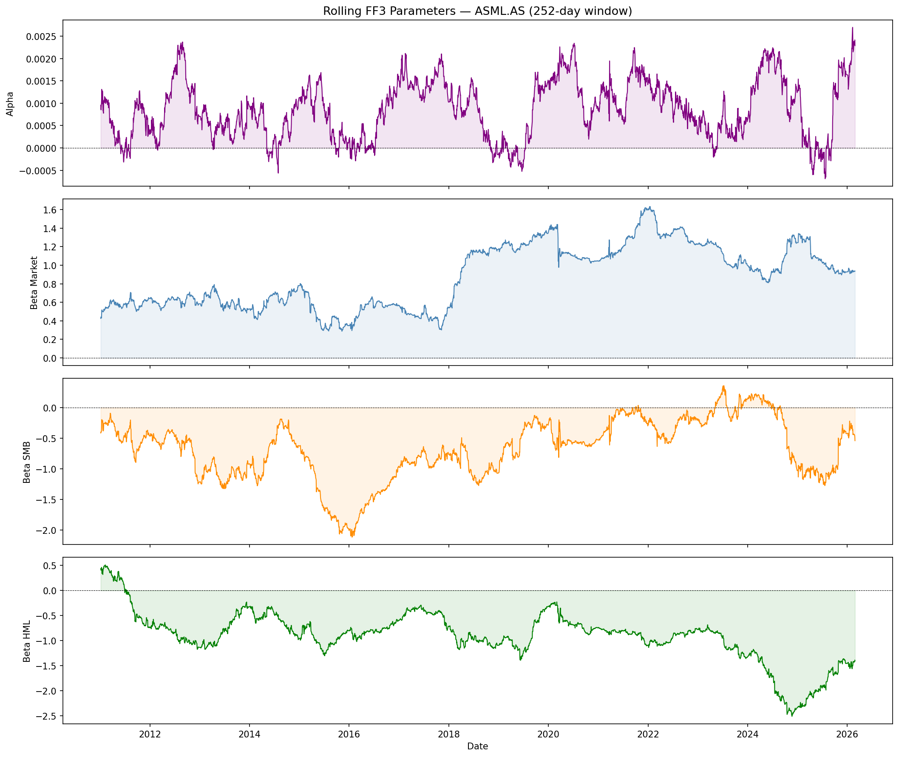
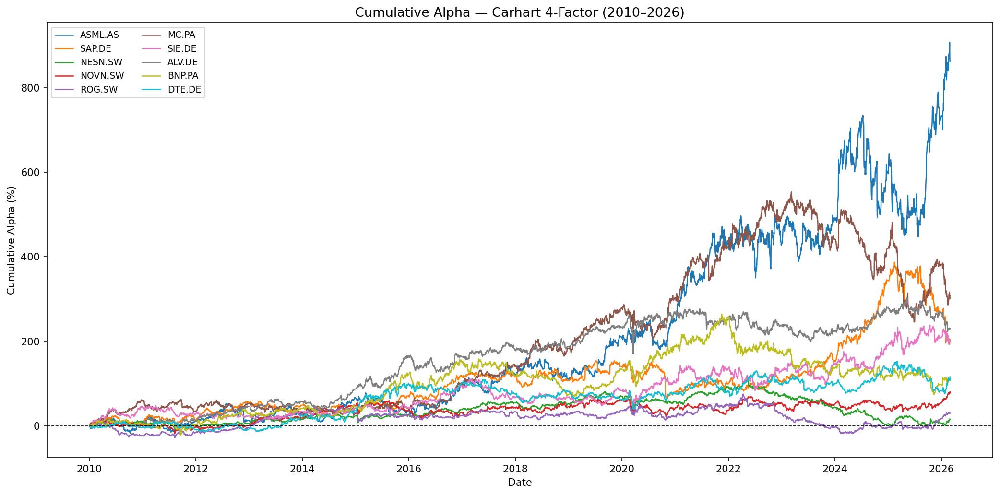

# Fama-French & Carhart Factor Models — European Large Caps

Empirical analysis of the Fama-French 3-factor and Carhart 4-factor models 
on a cross-section of European large cap equities (2010–2026).

## Research Question

Do systematic risk factors (market, size, value, momentum) fully explain 
the cross-sectional returns of European large caps, or do individual stocks 
generate persistent abnormal returns (alpha)?

## Key Findings

- **ASML** is the only stock with statistically significant alpha across both 
  models (t = 2.67 in the 4-factor model), generating over 900% cumulative 
  abnormal return over 15 years
- Adding the **momentum factor** (WML) marginally improves model fit for 
  European large caps — FF3 is nearly sufficient
- **Rolling betas** reveal substantial time-variation in factor exposures: 
  ASML's market beta doubled from ~0.5 to ~1.5 between 2010 and 2020 as 
  the stock transitioned from defensive to cyclical
- Clear **growth vs value** split: ASML and SAP load negatively on HML 
  (pure growth), while ALV and BNP load positively (value)

## Data

| Source | Description |
|--------|-------------|
| [Kenneth French Data Library](https://mba.tuck.dartmouth.edu/pages/faculty/ken.french/) | FF3 and momentum factors, Europe, daily |
| [Yahoo Finance](https://finance.yahoo.com/) via `yfinance` | Adjusted daily prices, 10 European large caps |

**Sample period:** January 2010 – February 2026  
**Frequency:** Daily  
**Universe:** ASML, SAP, Nestlé, Novartis, Roche, LVMH, Siemens, Allianz, BNP Paribas, Deutsche Telekom

## Methodology

**Model 1 — Fama-French 3-Factor:**

$$R_i - R_f = \alpha + \beta_1 \cdot MKT\text{-}RF + \beta_2 \cdot SMB + \beta_3 \cdot HML + \varepsilon$$

**Model 2 — Carhart 4-Factor:**

$$R_i - R_f = \alpha + \beta_1 \cdot MKT\text{-}RF + \beta_2 \cdot SMB + \beta_3 \cdot HML + \beta_4 \cdot WML + \varepsilon$$

Estimation via OLS. Rolling parameters computed on a 252-day expanding window.

## Results

### Factor Loadings — FF3


### Rolling Parameters — ASML


### Cumulative Alpha — Carhart 4-Factor


## Repository Structure
ff3-european/
├── data/               # raw data (gitignored)
├── notebooks/
│   └── 01_exploration.ipynb    # main analysis
├── src/                # reusable modules (WIP)
├── results/            # output charts
└── README.md

## Requirements

```bash
conda create -n ff3 python=3.11
conda activate ff3
pip install pandas numpy statsmodels matplotlib seaborn yfinance jupyter
```

## Author

Francesco — Economics & Finance, Università Bocconi  
Research interests: quantitative asset pricing, high-frequency factor models, 
market microstructure